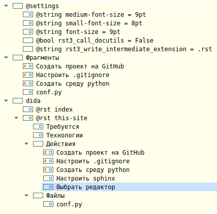

.. rst3: filename: leo

.. _chapter_leo:

Редактор Leo
============

В проекте используется редактор `Leo Editor <https://leoeditor.com>`_. Это довольно специфическая среда редактирования/программирования, обладающая при всей непривычности несколькими привлекательными для данного проекта особенностями:

- Во-первых, Leo написан на python и инсталлируется привычной командой ``pip install leo``. 
- Во-вторых, вся текстовая часть сайта, с учетом структуры, сохраняется в едином файле (внешние ресурсы --- картинки, pdf-файлы и т.п. --- нужно держать отдельно). 
- В-третьих, единица редактирования --- не файл, а блок текста (outline). Структура контента хорошо видна, удобно редактировать мелкие фрагменты, а потом собирать из них сайт. Набор rst-файлов, готовых для обработки sphinx, генерируется одной командой. 
- И наконец, есть "клоны", т.е. синхронно обновляемые блоки, которые могут использоваться независимо. Изменение одного из клонов приводит к автоматическому обновлению соответствующих фрагментов других страниц сайта.

Для примера ниже приводится сриншот панели Outline на момент редактирования главы "Этот сайт".

Примечательно следующее:

- под @settings можно переопределять системные параметры, даже такие "глобальные" как размер шрифта
- rst3_call_docutils = False говорит системе, что использется Sphinx а не docutils
- заметки под @rst this-site объединяются в единый файл this-site.rst, причем заголовки заметок становятся заголовками подразделов
- некоторые заметки, такие как "Настроить проект на GitHub" --- это клоны заметок, подготовленных во "Фрагментах"
- генерация rst-файлов происходит по команде ``rst3``, заданной в минибуфере

